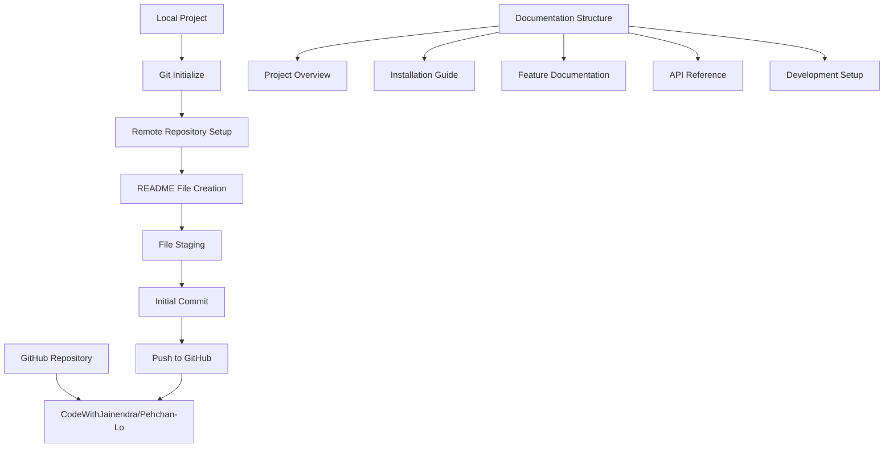
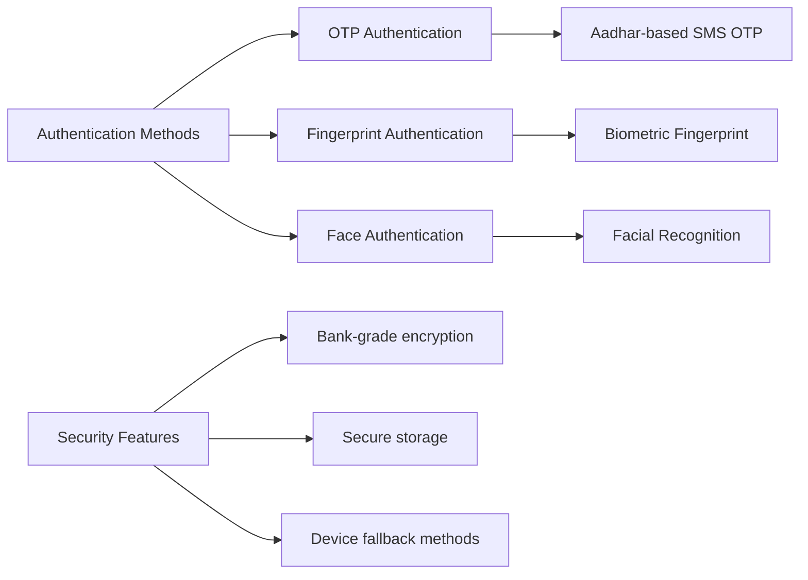
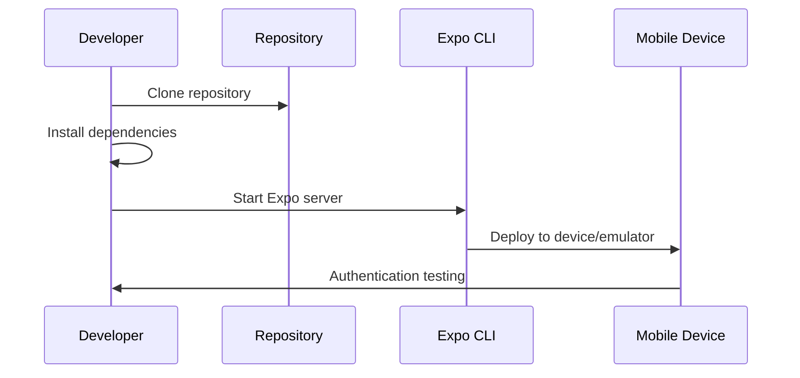
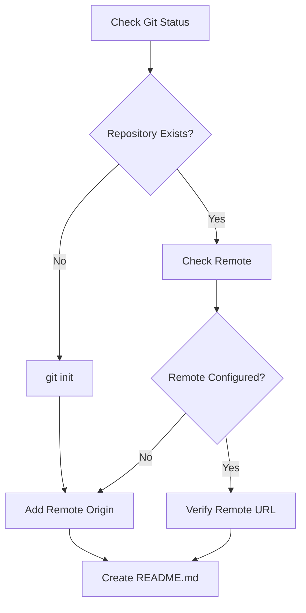
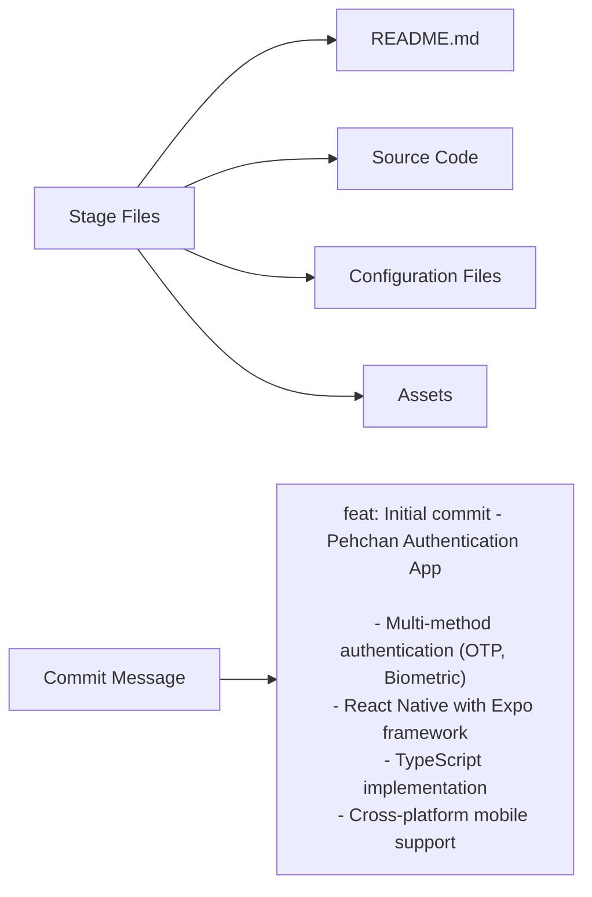
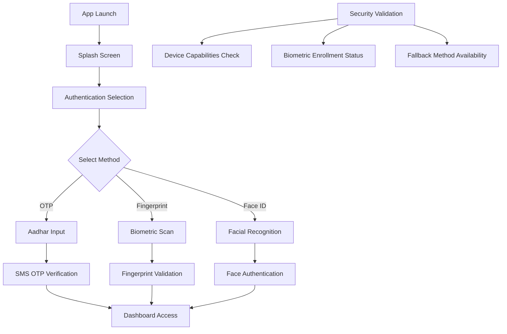
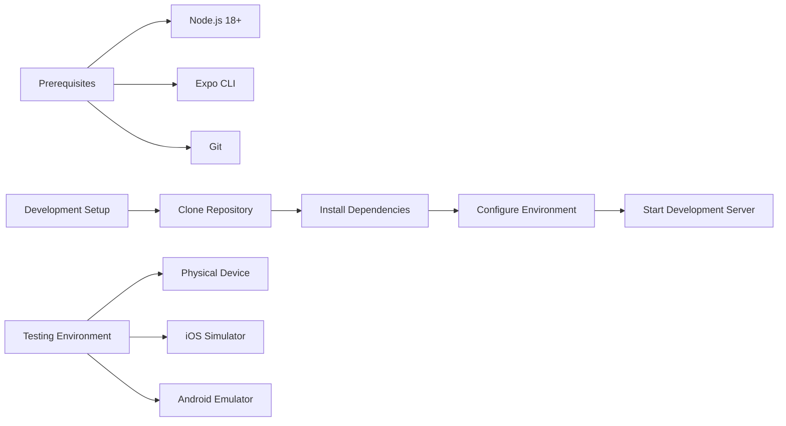
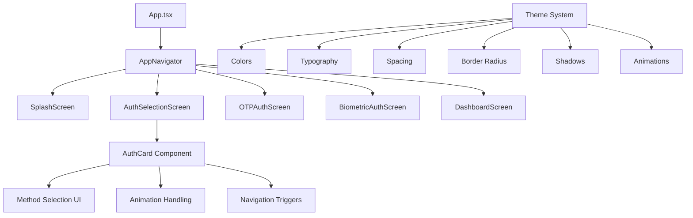
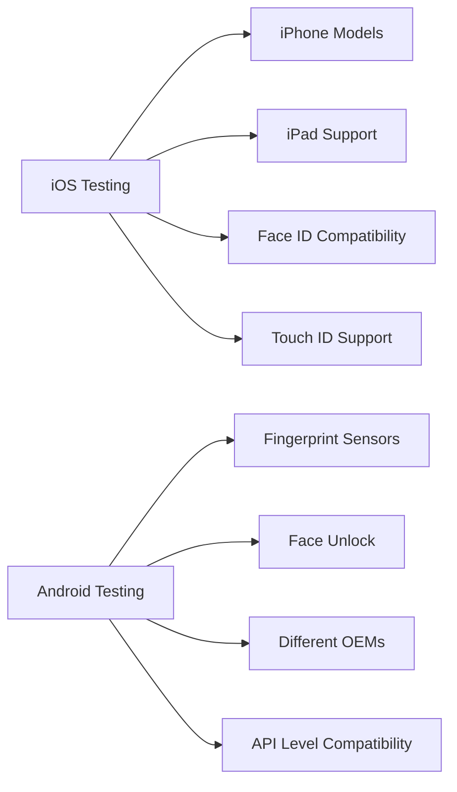
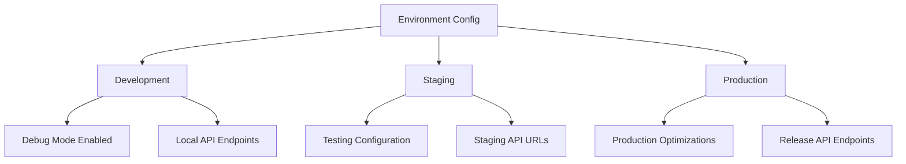

# Git Push with README File Implementation Design

## Overview

This design document outlines the implementation for pushing the Pehchan Authentication App to GitHub repository `https://github.com/CodeWithJainendra/Pehchan-Lo` with a comprehensive README file. The project is a React Native mobile application built with Expo that provides multiple authentication methods including OTP, fingerprint, and face authentication.

## Repository Type Detection

**Project Type**: Mobile Application (React Native with Expo)

**Key Indicators**:
- Uses Expo framework (`expo` dependency, `app.json` configuration)
- React Native mobile app with biometric authentication features
- Cross-platform mobile application (iOS/Android)
- TypeScript implementation with navigation and gesture handling

## Git Repository Setup Architecture



## README File Structure Design

### 1. Project Header Section
| Component | Content |
|-----------|---------|
| Title | # Pehchan - Authentication App |
| Tagline | Modern multi-method authentication for mobile devices |
| Badges | React Native, Expo, TypeScript, Authentication |
| Logo/Banner | Project branding image |

### 2. Feature Overview Section


### 3. Technical Stack Documentation
| Category | Technologies |
|----------|-------------|
| Framework | React Native 0.79.6, Expo ~53.0.22 |
| Language | TypeScript ~5.8.3 |
| Navigation | React Navigation 6.x |
| Authentication | Expo Local Authentication |
| UI Components | Expo Vector Icons, Linear Gradient |
| State Management | React Hooks |
| Gesture Handling | React Native Gesture Handler |

### 4. Installation and Setup Guide


## File Organization Strategy

### Repository Structure
```
Pehchan-Lo/
├── README.md                 # Comprehensive project documentation
├── .gitignore               # Git ignore rules
├── package.json             # Dependencies and scripts
├── app.json                 # Expo configuration
├── App.tsx                  # Main application entry
├── src/
│   ├── components/          # Reusable UI components
│   │   └── AuthCard.tsx     # Authentication method cards
│   ├── screens/             # Application screens
│   │   ├── AuthSelectionScreen.tsx
│   │   ├── BiometricAuthScreen.tsx
│   │   ├── OTPAuthScreen.tsx
│   │   ├── DashboardScreen.tsx
│   │   └── SplashScreen.tsx
│   ├── navigation/          # Navigation configuration
│   ├── constants/           # Theme and configuration
│   ├── types/              # TypeScript type definitions
│   └── utils/              # Authentication utilities
└── assets/                 # Images and static resources
```

## Git Workflow Implementation

### 1. Repository Initialization


### 2. Pre-commit Validation
| Check Type | Validation |
|------------|------------|
| File Structure | Verify all source files present |
| Dependencies | Check package.json integrity |
| TypeScript | Validate type definitions |
| Expo Config | Verify app.json configuration |
| Assets | Confirm required assets exist |

### 3. Commit Strategy


## README Content Architecture

### Authentication Flow Documentation


### Security Features Documentation
| Feature | Implementation | Purpose |
|---------|---------------|---------|
| Biometric Authentication | Expo Local Authentication | Secure device-level auth |
| OTP Verification | SMS-based verification | Phone number validation |
| Secure Storage | Device keychain/keystore | Credential protection |
| Fallback Methods | PIN/Password options | Alternative authentication |
| Error Handling | Comprehensive error states | User experience optimization |

### Development Environment Setup


## API Documentation Structure

### Authentication Methods Interface
```typescript
interface AuthMethod {
  id: string;
  title: string;
  subtitle: string;
  description: string;
  icon: string;
  color: GradientColors;
}

interface UserProfile {
  id: string;
  name: string;
  authMethod: BiometricType | 'otp';
  lastLogin: Date;
}

interface BiometricCapabilities {
  isAvailable: boolean;
  hasHardware: boolean;
  isEnrolled: boolean;
  supportedTypes: number[];
}
```

### Component Architecture


## Testing Strategy Documentation

### Test Coverage Areas
| Test Type | Coverage | Tools |
|-----------|----------|-------|
| Unit Testing | Component logic, utilities | Jest |
| Integration Testing | Authentication flows | Detox |
| E2E Testing | Complete user journeys | Expo Testing |
| Device Testing | Biometric capabilities | Physical devices |
| Security Testing | Authentication validation | Manual testing |

### Device Compatibility Testing


## Deployment and Distribution

### Build Configuration
| Platform | Configuration | Output |
|----------|--------------|--------|
| iOS | Expo build:ios | .ipa file |
| Android | Expo build:android | .apk/.aab file |
| Development | Expo start | Development build |
| Production | EAS Build | Optimized builds |

### Environment Variables
